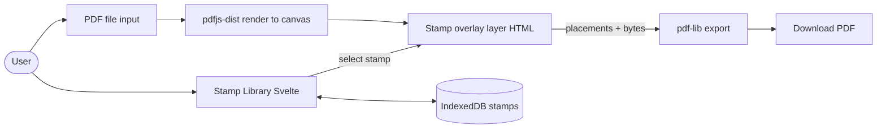

# timbrapp — PDF stamping web app

## Architecture

Pure browser app, zero backend. PDF rendering uses `pdfjs-dist`; final PDF mutation/export uses `pdf-lib`. Stamps live in IndexedDB via the small `idb` wrapper. SvelteKit is configured as a fully client-side SPA (`adapter-static`, `ssr=false` globally) because `pdfjs-dist` is browser-only.



Coordinate handling is the key tricky bit: `pdfjs-dist` renders at a chosen `scale` with origin top-left, while `pdf-lib`'s `page.drawImage` uses PDF points with origin bottom-left. A small `lib/pdf/coords.ts` module owns that conversion so it is done in exactly one place.

## Tech stack

- SvelteKit + TypeScript + Vite, `@sveltejs/adapter-static`
- `pdfjs-dist` (viewer/renderer) — worker wired via `new URL('pdfjs-dist/build/pdf.worker.mjs', import.meta.url)`
- `pdf-lib` (embed PNGs + save)
- `idb` (typed IndexedDB wrapper)
- `uuid` for stamp/placement IDs
- Vanilla CSS (no UI framework needed for an MVP)

## Project layout

```
timbrapp/
├── package.json
├── svelte.config.js          # adapter-static + ssr: false
├── vite.config.ts
├── tsconfig.json
├── static/
│   └── stamps/timbro_gorgia.png   # default stamp, copied from /stamp
└── src/
    ├── app.html
    ├── app.css
    ├── lib/
    │   ├── db/stampStore.ts       # IndexedDB CRUD: list/add/delete/get
    │   ├── db/seed.ts             # seeds timbro_gorgia.png on first run
    │   ├── pdf/render.ts          # load PDF, render page to canvas
    │   ├── pdf/coords.ts          # screen <-> PDF point conversion
    │   ├── pdf/save.ts            # pdf-lib: embed PNGs, drawImage, save
    │   ├── stores/editor.ts       # Svelte store: pdf, placements, selection
    │   └── components/
    │       ├── PdfDropzone.svelte
    │       ├── PdfViewer.svelte       # renders all pages + overlay slot
    │       ├── PageOverlay.svelte     # click-to-place + draggable stamps
    │       ├── PlacedStamp.svelte     # draggable/resizable stamp box
    │       ├── StampLibrary.svelte    # grid of stamps + upload + delete
    │       └── Toolbar.svelte         # save, clear, page nav, zoom
    └── routes/
        └── +page.svelte               # single-page editor
        └── +layout.ts                 # `export const ssr = false`
```

## Data models

```ts
type Stamp = {
  id: string;
  name: string;
  blob: Blob;           // image/png
  createdAt: number;
};

type Placement = {
  id: string;
  stampId: string;
  pageIndex: number;    // 0-based
  // stored in PDF points (origin bottom-left), so save is trivial
  x: number;
  y: number;
  width: number;
  height: number;
  rotation?: number;    // degrees, optional
};
```

## Key flows

1. **Bootstrap** — `seed.ts` checks if the `stamps` store is empty; if so fetches `/stamps/timbro_gorgia.png`, stores it as the first `Stamp`.
2. **Load PDF** — `PdfDropzone` accepts file or drag-drop, reads `ArrayBuffer`, hands it to `pdf/render.ts` which returns a `PDFDocumentProxy` plus per-page `{width, height}` in points. Bytes are kept in the editor store for later saving.
3. **Render** — `PdfViewer` iterates pages, renders each into a `<canvas>` at `scale = 1.5`, then overlays an absolutely-positioned `PageOverlay` of the same CSS size that hosts placed stamps and receives clicks.
4. **Place stamp** — When a stamp is selected in `StampLibrary` and the user clicks an overlay, a `Placement` is appended at the click point (centered) with default size. `PlacedStamp` renders the PNG (from a cached `objectURL`) and supports drag (pointer events) + corner resize.
5. **Save** — `pdf/save.ts`:
   - `PDFDocument.load(originalBytes)`
   - For each unique `stampId` used: `embedPng(await blob.arrayBuffer())`
   - For each `Placement`: `pages[pageIndex].drawImage(img, { x, y, width, height, rotate: degrees(rotation) })` (coords already in PDF space)
   - `doc.save()` → `Blob` → trigger download as `<originalName>-stamped.pdf`.

## Tricky bits to nail down

- **SSR off**: `+layout.ts` exports `export const ssr = false; export const prerender = false;` so `pdfjs-dist` is never imported on the server.
- **Worker URL**: in `lib/pdf/render.ts`, set `GlobalWorkerOptions.workerSrc = new URL('pdfjs-dist/build/pdf.worker.mjs', import.meta.url).toString();` — Vite handles bundling the worker.
- **Coord conversion** (one place, `lib/pdf/coords.ts`):
  - screen → PDF: `x_pdf = x_css / scale`, `y_pdf = pageHeight - (y_css + h_css) / scale`
  - storing placements directly in PDF points avoids re-converting on save.
- **Object URLs**: revoke in `onDestroy` to avoid leaks for stamp previews.
- **Aspect-ratio preservation** when placing a stamp the first time (default width = 120 pt, height derived from PNG natural dimensions).

## Testing approach (manual MVP)

- Load a 1-page and a multi-page PDF.
- Place 2 stamps on different pages, drag, resize, delete one.
- Save and reopen the downloaded PDF in a separate viewer to verify positions match what was on screen.
- Add a custom PNG stamp via the library, reload the page, confirm it persists (IndexedDB).

## Out of scope for MVP (note for follow-up)

- Annotation persistence across reloads (in-progress edit state).
- Stamp rotation UI (data model already supports it).
- Touch gestures / pinch zoom.
- Encrypted PDFs / form-field editing.
